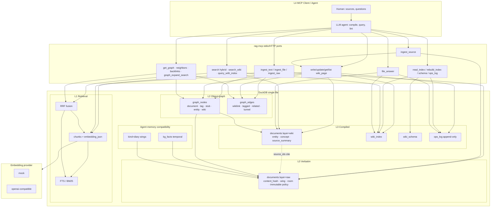
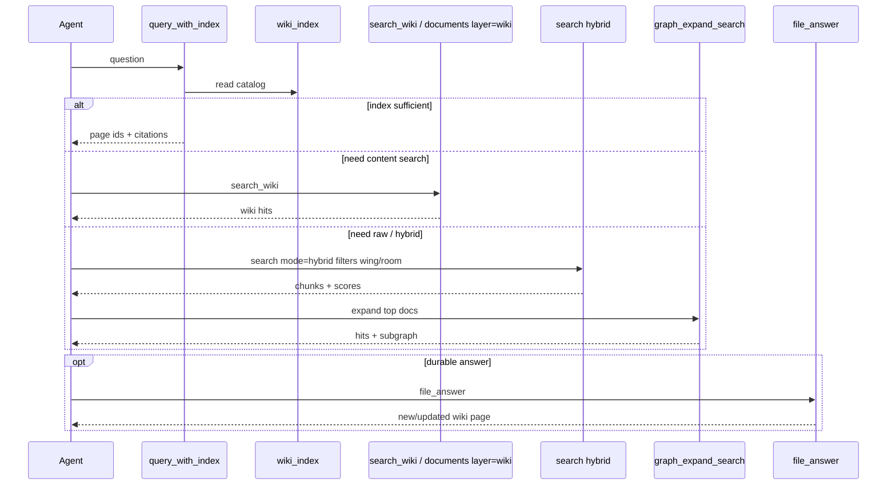

# rag-mcp architecture mechanics

**Product:** `rag-mcp` (Rust + DuckDB, stdio/HTTP MCP)

**Status:** current layer mechanics plus explicit target boundaries
**Sources blended:** Karpathy LLM Wiki (compile-once), MemPalace (verbatim + palace scope), rag-mcp SPEC (vector chunks + Obsidian object graph)

**North star:** [`ARCHITECTURE_VISION.md`](ARCHITECTURE_VISION.md) · **Principles:** [`PRODUCT_PRINCIPLES.md`](PRODUCT_PRINCIPLES.md) · **Map:** [`SYSTEM_MAP.md`](SYSTEM_MAP.md)

This document is the **layer mechanics** companion (data plane, workflows, invariants detail). It does not replace `SPEC.md` (v1 contract), vision/principles (product intent), or `FEATURES.md` / `docs/ROADMAP.md` (research / sequencing). It explains **how the three ideas fit together** in one logical store (DuckDB default adapter).

---

## 1. Problem the architecture solves

Three retrieval philosophies pull in different directions:

| Source | Core move | Failure mode if used alone |
|--------|-----------|----------------------------|
| **Classic RAG** (our v1) | Chunk + embed + cosine at query time | No accumulation: every answer re-derives synthesis from fragments |
| **Karpathy LLM Wiki** | Immutable raw → LLM compiles interlinked wiki (index, log, schema) | Without good search/scope, large wikis still need fallback retrieval |
| **MemPalace** | Verbatim drawers, wing/room hierarchy, hybrid search, optional temporal KG | Flat palace without compile: no compounding entity/concept pages |

**Target thesis for rag-mcp:**

> Keep **verbatim raw** (MemPalace drawers) and **vector + FTS + graph** as honest substrate. Sit a **compiled wiki layer** (Karpathy) on top, agent-written, index-first, logged. Scope everything with **wing/room** and Obsidian-like **nodes/edges**. One binary, one DuckDB file, no external vector DB as primary store.

Hybrid BM25+vector does **not** replace compile; it makes raw fallback and large catalogs work. Compile does **not** delete raw; raw remains source of truth.

---

## 2. Design principles (ordered)

1. **Single logical store, honest physical capabilities.** The current
   `Storage` trait covers document lifecycle; **DuckDB is the only full
   application adapter**. Markdown is an opt-in document SoT with sidecar
   rebuild/watch. Other ports require capability conformance before they are
   product backends — see [`STORAGE_ADAPTERS.md`](STORAGE_ADAPTERS.md).
2. **Layers, not mutually exclusive modes.** Raw is immutable; wiki/schema/index/log are agent-mutable; graph spans both.
3. **Verbatim first, synthesis second.** Ingest stores full text and chunks without mandatory LLM extract. Compilation is an explicit agent workflow (`ingest_source` + `write_wiki_page` / `file_answer`), not a silent rewrite of source rows.
4. **Deterministic graph extract for structure.** `[[wikilink]]`, `#tag`, stubs, promote-on-title: keep SPEC behavior. No mandatory LLM cognify / LightRAG NER for core graph.
5. **Index-first when small, hybrid when large.** Prefer `query_with_index` / catalog navigation; fall back to `search_wiki` then scoped `search` / `search_raw`.
6. **Scope before flat scan.** `wing`, `room`, `source_file`, `layer`, tag filters on search and graph export.
7. **Compounding memory.** Good answers are filed (`file_answer`); ops are append-only (`ops_log`); re-ingest is content-hash / uri idempotent.
8. **MCP surface stays substrate-honest.** Do not rename existing tools into a 36-tool “palace” dialect. Add tools; do not rebrand `search` as drawers-only jargon by default.
9. **Portable embeddings path.** Exact cosine in Rust over `embedding_json`
   remains default until the measured VSS/HNSW gate fails. FTS/BM25 is shipped
   substrate behavior.
10. **Agent owns synthesis; server owns storage, search, graph hygiene, policy.**

---

## 3. Conceptual model: five layers

```
┌─────────────────────────────────────────────────────────────┐
│  L4  Agent / MCP client  (compile, query, lint, file_answer) │
├─────────────────────────────────────────────────────────────┤
│  L3  Compiled knowledge   wiki pages · index · schema · log  │
├─────────────────────────────────────────────────────────────┤
│  L2  Object graph         nodes · edges · stubs · tunnels    │
├─────────────────────────────────────────────────────────────┤
│  L1  Retrieval substrate  chunks · embeddings · FTS · RRF    │
├─────────────────────────────────────────────────────────────┤
│  L0  Verbatim corpus      raw documents · wing/room · hash   │
└─────────────────────────────────────────────────────────────┘
     Full application SoT: DuckDB; limited document SoT: Markdown
```

| Layer | Karpathy analogue | MemPalace analogue | rag-mcp tables / tools |
|-------|-------------------|--------------------|------------------------|
| **L0 Verbatim** | Raw sources (immutable by write policy) | Drawers + full text | `documents` with `layer=raw`; `ingest_raw`, `get_source` |
| **L1 Retrieval** | Raw fallback and compiled-page retrieval | Hybrid BM25+vector, scoped search | `chunks.embedding_json` + FTS; `search(mode=lex\|vec\|hybrid)` |
| **L2 Graph** | Wikilinks in markdown / Obsidian view | Halls/tags; tunnels | `graph_nodes`, `graph_edges`; extract/resolve; `get_neighbors`, `get_backlinks` |
| **L3 Compile** | Wiki + schema + index.md + log.md | Closets/summaries; wake-up and diary compatibility | `documents` with `layer=wiki`, `wiki_index`, `wiki_schema`, `ops_log` |
| **L4 Agent** | Human+LLM workflows | wake_up, diaries, checkpoint | MCP tools; client protocols and hooks |

**Mapping vocabulary (use product names, not marketing):**

| External term | rag-mcp name |
|---------------|--------------|
| Drawer | chunk (+ full document content) |
| Wing / room | `documents.wing` / `documents.room` |
| Hall | tag nodes + optional category |
| Tunnel | `graph_edges.rel_type = 'tunnel'` |
| Closet (summary) | wiki page `kind=source_summary` (compiled, not a rewrite of raw) |
| Wiki page | `documents.layer='wiki'` |
| index.md | `wiki_index` + `read_index` / `rebuild_index` |
| log.md | `ops_log` + `append_log` / `read_log` |
| Schema / AGENTS.md | `wiki_schema` + `get_schema` / `update_schema` |

---

## 4. Data plane (DuckDB)

### 4.1 Keep (SPEC v1 substrate)

- `documents` — full text, uri, title, metadata, timestamps  
- `chunks` — content, `embedding_json`, char offsets, document_id  
- `graph_nodes` — kinds: `document | tag | stub | entity`  
- `graph_edges` — types include `wikilink | tagged | related | mentions | tunnel`

Embeddings: JSON float arrays; rank cosine in Rust (portable). Connection: single open, `Mutex` (DuckDB not Sync).

### 4.2 Shipped additive schema

**Documents and revisions:**

- `documents` remains the single body table. Its migrated fields include
  `content_hash`, `wing`, `room`, `source_file`, `layer`, `kind`, `status`,
  `pinned`, `boost`, and `revision`.
- Wiki and raw bodies are distinguished by `layer`; there is no parallel
  `wiki_pages` or `raw_sources` table.
- URI ownership is enforced by Store-level CAS/conflict checks, including
  mixed concurrent ingest. It is not claimed as a database unique index.
- `document_revisions` stores immutable pre-update snapshots; timeline queries
  read lean metadata first and load one selected body lazily.

**Retrieval and graph:**

- Chunks retain embeddings, offsets, content hashes, and Markdown section /
  heading metadata. Chunk generation invalidates both exact-vector snapshots
  and FTS state.
- The next lex/hybrid read performs one serialized FTS refresh if generation is
  stale; writes do not eagerly rebuild the index.
- Search hits carry vector, lexical and fused scores plus snippet, placement and
  offsets. `graph_nodes` / `graph_edges` remain derived topology.

**Compile and integrity state:**

- `wiki_index` is the lean catalog for `documents.layer='wiki'`;
  `wiki_schema` stores conventions and `ops_log` stores explicit durable
  operation records.
- `embedding_manifest` gates vec/hybrid model and dimension compatibility;
  `schema_version` records migrations; `source_manifest` supports incremental
  source preflight and parent/subdirectory root rebinding.
- `kg_facts` and diary documents remain compatibility depth outside the
  default product identity.

### 4.3 Graph policy across layers

- Every raw document and every wiki page gets a graph node (stable id by uri/slug).
- Wikilink/tag extract runs on **both** raw and wiki content on write/update.
- Stub promotion: matching title/uri basename upgrades `stub` → `document`/`wiki` without breaking edge ids.
- Tunnels: explicit cross-wing edges (`rel_type=tunnel`), not inferred by default.
- Re-ingest by uri: prefer stable graph node id; rebuild edges from that source; respect `immutable` for raw content (new version = new source id or explicit supersede policy).

---

## 5. Control plane: workflows

### 5.1 Ingest (verbatim path)

```
ingest_text / ingest_file / ingest_raw
  → path allowlist check (ingest_file: RAG_INGEST_ROOTS)
  → normalize content; content_hash / duplicate and URI-ownership preflight
  → pure DocumentIndexer: chunk + embed before taking the Store transaction
  → begin atomic transaction
  → CAS insert/update document; replace chunks; advance chunk generation
  → graph: upsert node, delete old edges from node, extract [[ ]] / #tags, resolve stubs
  → commit (or full rollback)
  → source sync updates source_manifest after a successful file write
  → workflows that promise a durable operation record append ops_log explicitly
```

FTS is not part of the write transaction: the first later lex/hybrid read
refreshes stale FTS once before ranking. Source-manifest and promised ops-log
records are adjacent workflow state, not part of the document/chunk/graph
atomic unit.

Server does **not** invent entity pages here. That is compile.  
`ingest_file` must refuse paths outside `RAG_INGEST_ROOTS` (empty list = refuse all absolute paths, or require explicit config; implementers document default).

### 5.2 Compile (Karpathy path)

```
ingest_source (or human: "process this source")
  → ensure raw registered (L0)
  → agent reads schema (get_schema)
  → agent: write_wiki_page / update_wiki_page (summary, entities, concepts)
  → server: chunk+embed wiki pages (searchable), graph extract on wiki markdown
  → update_index_entry / rebuild_index
  → append_log (INGEST | WIKI)
```

Rules:

- One source may touch many wiki pages (entity, concept, source_summary).
- Contradictions and supersessions use explicit lint and `kg_supersede`; they are
  never inferred silently during ingest.
- Schema co-evolves via `update_schema`; server does not hardcode domain page templates beyond kinds.

### 5.3 Query (ordered cascade)

1. **`query_with_index`** — read catalog, pick slugs, load pages, answer with wiki citations.  
2. **`search_wiki`** — hybrid/vector restricted to `layer=wiki` (and related kinds).  
3. **`search`** — `mode=lex|vec|hybrid`, filter DSL, min_score, snippets; **diversity** (MMR / collapse_by_document); **token pack** (`max_context_tokens`); citation-ready hit fields (`score_vec` / `score_lex` / `score_rrf`, offsets, quote).  
4. **`graph_expand_search`** — top hits → document/wiki nodes → `neighbors(depth)` subgraph.  
5. **Raw fallback** — use the normal search layer filter explicitly.
6. **`file_answer`** — persist high-value answer as wiki page + index touch + log (compounding).

Before vec/hybrid: load `embedding_manifest`; if config model/dims differ from corpus, return structured error pointing to `reembed`.

### 5.4 Lint and health

- **Operational health:** `status` and `doctor` cover schema/FTS/embed manifest,
  layer counts, WAL and relational integrity; checkpoint and verified backup are
  gateway operations.
- **Graph/knowledge lint:** wiki/link health, unresolved stubs, orphans and stale
  compiled pages are explicit reports, not implicit mutation.
- **Bulk work:** source sync, reembed and maintenance expose bounded policies;
  HTTP source-sync jobs add progress and cooperative cancellation.

### 5.5 Agent memory (compatibility depth, MemPalace-aligned)

- `wake_up` — return L0 identity + L1 essential story docs (special uris / wings)  
- `diary_write` / `diary_read`, `checkpoint`  
- `kg_add` / `kg_query` / `kg_invalidate` / `kg_supersede` / `kg_timeline`  
- Tunnels: create / list / delete / follow  

Not required for wiki compile to work; orthogonal product depth for multi-session agents.

---

## 6. Module ownership

```
src/
  document_indexer.rs        # pure preparation: chunk, metadata, embed
  ingest.rs, source_sync.rs  # application orchestration
  retrieval.rs, revisions.rs # transport-independent commands
  graph/, wiki/              # graph extraction and compiled knowledge policy
  db/                        # DuckDB repositories and transaction owner
  storage/                   # bounded document backend contract
  mcp/, http_api/            # wire adapters
crates/rag-mcp-ui/           # native HTTP client and focused workspaces
```

Detailed path ownership is maintained in [`SYSTEM_MAP.md`](SYSTEM_MAP.md). File
size alone does not trigger a move; a slice moves only with behavior tests and
a delegation-only compatibility façade.

**Important:** the server does **not** call an LLM to “cognify” the graph (no mandatory NER). Default compilation is tool-driven: the **MCP client LLM** writes pages using wiki tools. **Optional** server-side chat (`RAG_LLM_*`, Ollama/LM Studio) may power `compile_*` / maintenance helpers when enabled; see [`LOCAL_LLM_MAINTENANCE.md`](LOCAL_LLM_MAINTENANCE.md). Server always owns storage, search, graph hygiene, and immutability policy.

---

## 7. MCP tool surface (architecture view)

### Substrate (keep / extend)

`ingest_text`, `ingest_file`, `search` (extend modes/filters), `list_documents`, `get_document`, `delete_document`, `stats` → `status`, `get_graph`, `get_neighbors`, `get_backlinks`, `link_nodes`, `find_node`

### Compile + compatibility depth (implemented full surface)

| Cluster | Tools |
|---------|--------|
| Scope | `list_wings`, `list_rooms`, `get_taxonomy`, `delete_by_source`, `check_duplicate` |
| Integrity | `status`, `doctor` (minimal), `get_embedding_manifest`, `reembed` / `reembed_document` |
| Raw | `ingest_raw`, `list_sources`, `get_source` |
| Wiki | `write_wiki_page`, `update_wiki_page`, `get_wiki_page`, `list_wiki_pages` |
| Catalog | `read_index`, `update_index_entry`, `rebuild_index` |
| Schema / log | `get_schema`, `update_schema`, `append_log`, `read_log`, `list_recent_ops` |
| Workflows | `ingest_source`, `query_with_index`, `search_wiki`, `file_answer`, `graph_expand_search` |
| Optional pack | `pack_context` (token-budgeted citation block) |

### Additional implemented depth

Lint, kg_*, wake_up, diaries, checkpoint, tunnels, memory lifecycle,
backup/export/import, expand_chunks, multi_get, find_similar, collections and
manifest-aware `sync_sources` exist on the full compatibility surface. Their
existence does not make them members of the default spine.

### Explicit non-builds (architecture constraints)

- External multi-backend vector DB as primary store  
- Mandatory LLM entity extraction for graph  
- AAAK dialect default-on  
- Rename existing tools to palace names  
- Server-side force-directed layout  
- Multi-tenant auth in early releases  

---

## 8. Target architecture diagram



### Query cascade (sequence)



---

## 9. Conflict resolutions (research → product)

| Tension | Resolution |
|---------|------------|
| Karpathy “anti-RAG / index only” vs hybrid BM25 | **Both:** index-first for compiled layer; hybrid is substrate quality and raw fallback. |
| MemPalace “never summarize” vs wiki summaries | **Split layers:** raw drawers never paraphrased; wiki summaries live only in L3 and cite raw ids. |
| Palace rename of tools vs SPEC names | **Keep SPEC names;** add wing/room as data, not as mandatory tool vocabulary. |
| LLM graph extract vs deterministic wikilinks | **Deterministic first;** entity kind reserved; cognify stays out of core. |
| Chroma multi-backend vs single DuckDB | **One logical store;** DuckDB is the full default adapter. Markdown currently implements only the honest document slice; SQL/composite ports require evidence and conformance. Remote vector DB alone is not SoT. |
| Closets vs wiki | Wiki `source_summary` / entity pages **are** the closet; no second parallel summary store. |
| “Server never calls LLM” vs local maintain | **No LLM for graph NER.** Optional local chat for compile/maintain tools; client remains default author of wiki knowledge. |
| Monolithic tool surface vs modular code | Default spine stays small; full compatibility tools are grouped in bounded routers without renaming public tools. |

---

## 10. Arrival status

The former v1/P0/P1 capability rows are implemented on the compatibility
surface: immutable/scoped corpus, hybrid retrieval, deterministic graph, wiki,
lint, memory depth, recovery, source sync, HTTP MCP and the native client. They
are historical sequence labels, not remaining work.

Current release acceptance and the only evidence-gated candidates live in
[`ROADMAP.md`](ROADMAP.md). In particular, VSS/HNSW is not scheduled while the
A recorded local 100,111-chunk exact-search observation remains below the
300 ms p95 gate; a representative rerun is required before an ANN decision.

Architecture continues through additive migrations and tested seams, not a
rewrite.

---

## 11. Invariants (definition of architectural success)

1. Deleting or corrupting wiki rows never loses raw source text.  
2. Re-ingest of identical `content_hash` is a no-op or explicit replace, never silent duplicate corpus bloat.  
3. Graph edge endpoints remain valid across re-ingest when uri/slug is stable.  
4. `search` can always fall back to raw chunks even if wiki is empty.  
5. `query_with_index` works with zero embeddings if catalog + pages exist (compile path offline-friendly with mock or empty L1).  
6. Durable domain mutations that promise an operation record use `ops_log`;
   bounded HTTP Activity is observability, not an audit replacement.
7. Stdout remains MCP-only; logging on stderr.  
8. One gateway process owns one active store path for writes (default:
   `RAG_DB_PATH` DuckDB); it may expose stdio and HTTP adapters over that Store.
9. `ingest_file` never reads outside `RAG_INGEST_ROOTS`.  
10. Vec/hybrid search never silently ranks with wrong embedding model/dims (manifest check or explicit reembed).  
11. Ingest is atomic: partial failure leaves neither half-chunks nor ghost edges.  
12. Writes advance the chunk generation; the next lexical/hybrid read performs
    one single-flight FTS refresh before ranking.
13. Hybrid results are agent-usable: citation fields, diversity, and token budget are first-class, not afterthoughts.

---

## 12. Related docs

| Doc | Role |
|-----|------|
| [`ARCHITECTURE_VISION.md`](ARCHITECTURE_VISION.md) | **North star**: what the product is |
| [`PRODUCT_PRINCIPLES.md`](PRODUCT_PRINCIPLES.md) | ordered laws + conflict resolutions |
| [`SYSTEM_MAP.md`](SYSTEM_MAP.md) | layers, modules, tool clusters |
| [`SPEC.md`](../SPEC.md) | v1 implementation contract |
| [`FEATURES.md`](../FEATURES.md) | research, tool list, proposed DDL, adversarial A1–A30 |
| [`docs/ROADMAP.md`](ROADMAP.md) | current release gate and evidence-gated candidates |
| [`docs/MCP_TOOL_MATRIX.md`](MCP_TOOL_MATRIX.md) | tool × Karpathy × MemPalace × priority |
| [`docs/STORAGE_ADAPTERS.md`](STORAGE_ADAPTERS.md) | backend strategy |
| [`docs/REPOS_SURVEYED.md`](REPOS_SURVEYED.md) | survey evidence (~105 sources) |

**External primary patterns:** Karpathy LLM Wiki gist (raw / wiki / schema, index.md, log.md, ingest-query-lint); MemPalace (verbatim drawers, wing/room, hybrid retrieval, temporal KG, wake-up, no mandatory cognify).

---

*End of architecture notes.*
