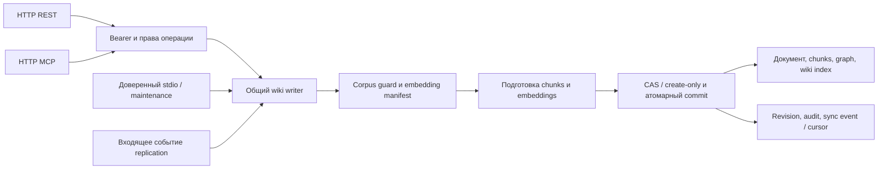

# Исправления по ревью от 5 сентября 2026

Рабочее дерево на основе `e485249`. Изменения ниже относятся к исходникам;
установленный gateway, LaunchAgent и живая DuckDB в этой работе не обновлялись.
Существовавшие до начала работы изменения пользователя сохранены.

## Исправленные дефекты

| № ревью | Изменение | Проверяемая гарантия |
|---|---|---|
| 1 | Общая Bearer-аутентификация HTTP/MCP; роли read/write/admin; web/native/replica передают токены | Remote bind без credentials запрещён до открытия БД; read не вызывает запись ни через REST, ни через MCP |
| 2 | Embedding manifest и corpus coordination проверяются внутри общего wiki writer | Несовместимая модель/endpoint/dimensions и одновременная миграция не смешивают векторы; вложенная maintenance использует явный scoped Store |
| 3 | `graph_edges.edge_origin`; rebuild заменяет только `derived`; freshness читает массивы источников | Ручные связи и зависимости не исчезают при re-ingest |
| 4 | Wiki, chunks, graph, catalog, audit и sync event в одной транзакции; incoming cursor в той же транзакции | RFC3339 roundtrip; batch проверяется до применения; повторы идемпотентны; повтор ID с другим payload — конфликт; replica применяет собственные canonical events |
| 5 | `POST /v1/wiki` создаёт только отсутствующую страницу; оба web-сценария создания, включая черновик из SearchView, используют POST | Проверка URI/ID внутри транзакции; занятый адрес возвращает 409, включая архивные страницы |
| 6 | Re-ingest сохраняет организацию документа и неуказанные metadata | Status/pinned/boost/wing/room сохраняются; импорт файла объединяет прежние metadata с данными extraction |
| 7 | `bin` исключается как .NET output только рядом с файлом проекта | Rust `src/bin` и каталоги скриптов индексируются; .NET output исключён из scan и cleanup одинаково |
| 8 | Web загружает каталог страницами; native добирает каталог; save использует snapshot и CAS | Во время медленного сохранения новый ввод остаётся dirty; навигация сохраняет черновик; ответы старой страницы не меняют новую |
| 9 | Doctor сначала удаляет orphan nodes, потом dangling edges | Одного repair достаточно для согласованных node/edge counts; повторный repair пуст |
| 10 | Compile/consolidate фиксируют URI/revision до LLM | Required-CAS работает; конкурентное создание или изменение целевой страницы приводит к конфликту, а не перезаписи |
| 11 | Однозначное кодирование имён Markdown, проверка владельца, публикация нового пути без замены существующего | Различаются `.`, `_.`, регистр и Unicode; старый путь мигрирует при сохранении; чужой документ не перезаписывается |

Wiki restore также использует общую атомарную границу с журналом репликации.
Пользовательское значение `agent=sync:…` больше не отключает журналирование.
Общие атомарные записи и прямые metadata updates `layer=wiki` страниц с
каноническим `wiki://slug` также журналируют title/content/wing/room/kind/metadata в той
же транзакции. Метаданные, изменённые после wiki write, не теряются при replay
предыдущего события; сбой журнала откатывает и metadata update.

## Дополнения к архитектуре

Модульный монолит и один gateway-владелец DuckDB сохранены. Защита embedding
identity, CAS и участие в журнале перемещены к общей границе записи, чтобы
новый транспорт не мог случайно обойти эти правила.

Подготовка embeddings выполняется до короткой транзакции; corpus guard остаётся
активным до commit. Background replication использует явный внутренний режим,
который нельзя включить строковым параметром пользовательского запроса.

- Compile/consolidate сохраняют `source_versions` с ID, URI и hash полного
  снимка источника, прочитанного до LLM. Изменение во время генерации сразу
  делает результат устаревшим; удалённый источник остаётся видимым в диагностике.
  Метаданные зависимостей передаются вместе с wiki при replication.
- Поиск ограничивает ожидание embeddings общим `timeout_ms`, затем передаёт
  остаток бюджета retrieval. HTTP embedding clients имеют connect timeout 10 с
  и request timeout 120 с. Синхронный вызов DuckDB пока проверяет deadline
  между этапами: это не гарантия немедленного прерывания SQL.
- `max_context_tokens` ограничивает весь форматированный блок, включая
  цитаты и expansion; скрытые копии текста в `context/snippet` убираются.
  Подробный контракт: [TOKEN_BUDGET.md](TOKEN_BUDGET.md).
- Diversity добирает кандидатов в vec/lex/hybrid с прежними scope-фильтрами,
  общим deadline и границей 4096 на источник. Timings суммируют все раунды;
  достижение границы отмечается в explanation. Сценарий с 60 фрагментами
  одного документа больше не вытесняет второй документ при `top_k=2`.
- Добавлена GitHub Actions конфигурация: workspace tests, web check/tests/build
  и пример retrieval eval. Сам workflow ещё не запускался на GitHub.

## Совместимость и ввод в работу

1. Снять согласованный backup через единственный работающий gateway и проверить
   восстановление на отдельной временной БД. Не открывать живую БД вторым процессом.
2. Согласовать credentials работающих клиентов, затем обновлять сервер и клиентов
   вместе. Токены включаются и для loopback. Настройка и роли:
   [AUTHENTICATION.md](AUTHENTICATION.md).
3. Schema 11 добавляет nullable `graph_edges.edge_origin`. Происхождение старых
   связей неизвестно: они сохраняются, совпадающие новые связи не дублируются.
   Устаревшие legacy-связи могут остаться до отдельной классификации; по одному
   типу/контексту невозможно безопасно доказать, что связь была автоматической.
4. Старые wiki без `source_versions` используют timestamp fallback; hash-гарантия
   появляется после новой компиляции. Отсутствующий источник не пересоздаётся
   автоматически. Детали: [LOCAL_LLM_WIKI.md](LOCAL_LLM_WIKI.md).
5. Replication охватывает wiki create/update/restore и metadata-only изменения
   title/content/wing/room/kind/metadata канонических wiki URI. Status, pinned,
   boost, source_file и layer остаются локальными. Raw sources, удаления,
   архивирование и прочие lifecycle-операции не реплицируются.
   Bootstrap и tombstones остаются отдельной работой:
   [DATABASE_SYNC.md](DATABASE_SYNC.md).
6. Native-каталог ограничен 10000 страницами и общим deadline 60 с; незавершённая
   загрузка возвращает явную ошибку и сохраняет последний успешный каталог.
   Web использует offset pagination; это не snapshot при одновременных изменениях
   каталога. Refresh начинает загрузку заново.
7. После внедрения повторно ingest изменённых файлов через gateway с прежними
   `file://` URI, `wing=rag`, `room=src/docs`; wiki обновлять через read-then-CAS.
   До обновления gateway это не выполнено: старый путь re-ingest содержит
   исправленные здесь ошибки потери metadata и ручных связей.

## Следующие этапы

1. Durable jobs и единое завершение background workers: persisted intent,
   progress/result, interrupted после restart, cancellation/drain/checkpoint.
2. Ограниченный blocking executor для синхронной БД/extraction, ограничения PDF,
   полное управление deadline и отменой долгих операций.
3. DTO отдельно от server crate, общие storage conformance/CAS contracts;
   миграция orchestration из transport facade по одному use case.
4. Размеченный продуктовый eval на 100–200 русских/английских задачах и отдельный
   нагрузочный профиль актуального корпуса. Example eval — проверка механики,
   его результаты не доказывают качество реального поиска или производительность
   живой базы. Нужны отдельные cold/warm и concurrent search/sync/backup замеры.

## Валидация

- `cargo test --workspace --locked`: 697 тестов прошли, ошибок нет. Прогон
  выполнен с теми же mock/LLM environment settings, которые заданы в CI;
  локальный компилятор — Rust 1.98 nightly. GitHub workflow выбирает stable,
  его удалённый запуск отдельно не выполнялся.
- Web: 29 тестов прошли; `svelte-check` — 0 ошибок/предупреждений;
  production build успешен. Остаётся предупреждение сборщика о крупных
  Mermaid chunks; это не ошибка проверки или сборки.
- Browser QA: вход/отзыв токена, каталог 50→75 страниц, ввод во время
  сохранения с задержкой 12 секунд. Native pagination проверена тестами;
  отдельный визуальный прогон native-приложения не проводился.
- Изолированные replication-тесты проверяют retry/restart, конкурентные
  записи, более 100 pending events, metadata между push/ack/pull, rollback,
  canonical timestamps и граничные размеры событий. Это проверки протокола
  на временных узлах, не подтверждение работы установленных реплик.
- Запуск серверного бинарника проверен отдельно: remote без токена или с
  одинаковыми токенами разных ролей завершается до создания директории БД,
  credentials не попадают в ошибку.
- Example lexical eval прошёл: recall@5=1, MRR=1,
  nDCG@5≈0.782. Это 3 документа и 2 вопроса из example dataset, не продуктовая
  оценка качества.
- `git diff --check` чист; локальные ссылки в новых документах проверены.
- Финальный read-only MCP status живого gateway: schema 10,
  82 438 документов / 642 644 chunks, embedding manifest совпадает,
  `ready_for_search=true`. Живой сервис продолжает работать на прежней версии.

Полные логи этого локального прогона: `/tmp/rag-verified-workspace-tests.log`,
`/tmp/rag-final-web-check.log`, `/tmp/rag-final-web-tests.log`,
`/tmp/rag-final-web-build.log`, `/tmp/rag-verified-eval.json`.
